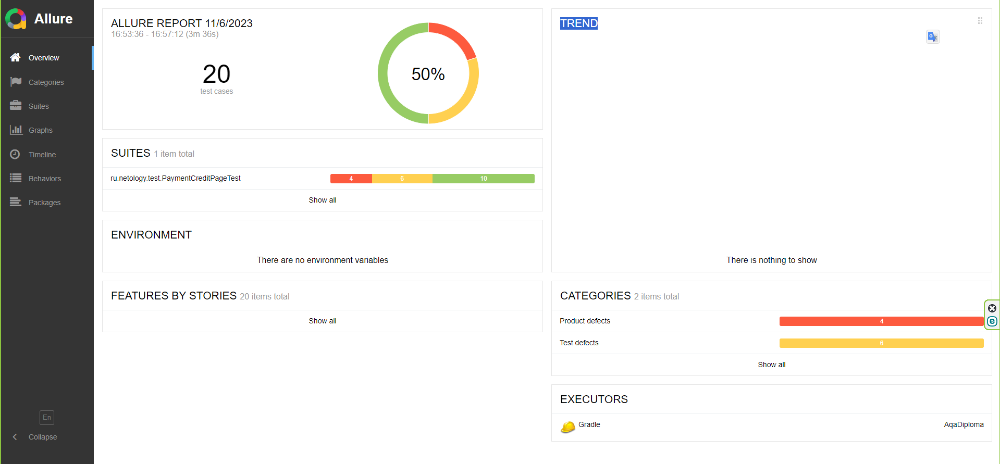

## Отчет о выполнении автоматизированного тестирования.

Было реализовано 20 автоматизированных сценариев проверки работы веб приложения:
* 8 UI-тестов
* 6 тестов на проверку занесения данных в СУБД MySQL
* 6 тестов на проверку занесения данных в СУБД PostgreSQL

При подключении к СУБД MySQL
* 50% - тестов пройдено успешно,
* 30% - для PostgreSQL не поддерживаются
* 20% - провалены

При подключении к СУБД PostgreSQL
* 50% - тестов пройдено успешно,
* 30% - для MySQL не поддерживаются
* 20% - провалены

[Репорты](https://github.com/8highflyer8/AqaDiploma/issues)  
В итоге занесено 7 баг-репортов (1 дефект был обнаружен при иследовательском ручном тестировании)  
Отчеты можно сгенерировать с помощью Gradle, Allure командой  
`./gradlew clean test --info` и затем после заверешения `./gradlew allureserve`

Стоит обратить внимание, на то что сервис списывает сумму значительно большую сумму,  
чем указано на странице. Думаю следует в первую очередь исправить данный дефект  
Так же не проработан отказ в оплате с отклоненной карте.  
Для ускорения автоматизации тестирования необходимо вводить тестовые метки на кнопки и поля